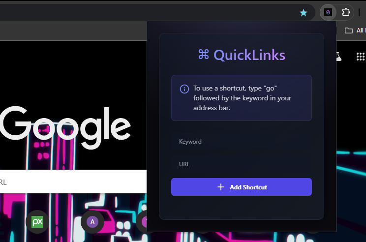
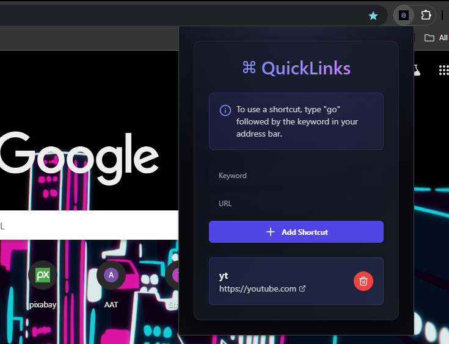

# QuickLinks Chrome Extension

QuickLinks is a Chrome extension that lets you create shortcuts to your favorite URLs. By setting keywords for URLs, you can quickly access them by typing `go` followed by the keyword in the address bar. This extension streamlines navigation, saving you time and effort on frequently visited sites.

## Features

- **Custom Shortcuts**: Easily create keyword shortcuts for any URL.
- **Quick Navigation**: Type `go` followed by your keyword in the address bar to quickly reach the associated URL.
- **Persistent Storage**: All shortcuts are saved locally using Chrome Storage, allowing for easy retrieval across sessions.

## Screenshots

### Main Interface


### Adding a Shortcut


## Video Demonstration

Check out the video demonstration of the extension in action:

[![QuickLinks Demo]](https://res.cloudinary.com/dpj8y0x4s/video/upload/v1730994176/Quicklinks_edhzua.mp4)

## Tech Stack

This extension is built with:
- **React** and **TypeScript** for a robust, type-safe user interface.
- **Tailwind CSS** for responsive and modern styling.
- **Chrome Storage API** for persistent, local storage of your shortcuts.

## Usage

1. **Add a Shortcut**:
   - Open the extension.
   - Enter a keyword and URL in the input fields.
   - Click **Add Shortcut**.

2. **Use a Shortcut**:
   - In the Chrome address bar, type `go <keyword>` (e.g., `go yt` for YouTube) and press **Enter**.
   - You will be redirected to the URL associated with the keyword.

   ```text
   Example:
   go yt  ➔ Redirects to https://youtube.com

3. **Remove Shortcut**:
   - In the extension, click the trash icon next to a shortcut to delete it from your list.
